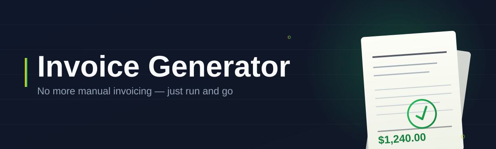

# invoice-config-editor 🧾✨

  

*The invoice generator config editor that treats your billing templates like first-class citizens, not buried JSON.*

<strong>📖 The origin story — why this exists</strong>

 

It started with a spreadsheet. Then it became three spreadsheets, a half-broken macro, and a folder named `invoices_FINAL_v3_USE_THIS_ONE`. Like every indie dev who has ever billed a client, I hit the wall where "just edit the template by hand" stopped being a joke and started being my Tuesday night.

Every invoice generator I found either locked its templates behind a paid cloud dashboard, or exposed a raw config file that punished a single misplaced comma with a silent failure. I wanted something in between — a real editor, with real validation, that respects the fact that invoice configs are *structured data*, not prose.

So `invoice-config-editor` was born as a weekend project that refused to stay small. It grew a live preview pane. Then a schema validator. Then a theme system, because staring at pale gray for six hours straight is its own kind of billing dispute. What you're looking at now is the result of a lot of coffee, a lot of "just one more field," and a genuine belief that invoicing tools deserve better UX than a text editor and a prayer.

---

## 🔭 Overview

`invoice-config-editor` is a focused, standalone Windows application for building and maintaining the configuration files that power your invoice generator pipeline — line-item schemas, tax rules, currency formatting, branding blocks, recurring billing templates, and the metadata your PDF renderer actually consumes. Instead of hand-editing brittle JSON or YAML and hoping nothing typos its way into a client's invoice, you get a structured visual editor with instant validation and a live preview that mirrors what your final invoice will actually look like.

This tool exists for freelancers, small studios, agencies, and anyone running a bootstrapped SaaS who needs invoice generation that's *configurable* without needing to become a config-file archaeologist every time tax season changes the rules. It's built for the person who wants their invoice templates version-controlled, human-readable, and editable without fear — no cloud lock-in, no subscription gate, no mystery API calls home.

Whether you're maintaining a single freelance invoice template or juggling multi-currency, multi-tax-jurisdiction configs across a dozen clients, `invoice-config-editor` gives your config files a real interface — one that catches mistakes before they become an awkward email to a client asking why their invoice total is wrong.

 

  

---

## 🚀 What It Actually Does

1. **Structured schema editing** — walk through your invoice config as labeled fields and sections instead of raw text, so nested tax rules and line-item templates stop feeling like a minefield.

2. **Live invoice preview** — every edit reflects instantly in a rendered preview pane, so you see the actual invoice layout, not just the underlying data.

3. **Multi-currency & tax-rule support** — configure regional tax logic, currency symbols, and rounding behavior per template, ideal for freelancers billing across borders.

4. **Template versioning awareness** — configs are stored in clean, diffable formats so your invoice generator setup plays nicely with version control.

5. **Validation on save** — the editor flags malformed fields, missing required keys, and broken references before they ever reach your invoice generator.

6. **Recurring billing blueprints** — define reusable subscription or retainer invoice templates once, then spin off client-specific variants in seconds.

7. **Branding & layout blocks** — logo placement, color accents, and footer legal text live in their own editable section, decoupled from your line-item logic.

8. **Import/export portability** — bring in existing configs from other invoice generator setups or export yours for backup, sharing, or migration.

9. **Offline-first by design** — nothing you edit is transmitted anywhere; your client data and pricing structures stay on your machine.

10. **Dark and light themes** — because config editing at 11pm deserves better than a retina-searing white canvas.

> [!TIP]
> Start with the **Template Wizard** under `File → New From Template` — it scaffolds a valid invoice config skeleton so you're editing rather than building from a blank canvas.

---

## 🏁 Getting Started

1. Visit the landing page and grab the latest build using the download button above (or below).

2. Run the standalone executable — no installer wizard, no admin prompts, no background services.

3. Open an existing invoice config file, or use `File → New From Template` to scaffold one from scratch.

4. Edit fields in the structured panel, watch the live preview update, and export your finished config for your invoice generator to consume.

> [!NOTE]
> The app ships as a single portable `.exe`. You can run it from a USB drive, a synced folder, or anywhere else — it doesn't write anything outside its own working directory unless you tell it to.

---

## 💻 System Requirements

| Requirement | Details |
|---|---|
| OS | Windows 10 or Windows 11 (64-bit) |
| Dependencies | None — fully standalone |
| Disk space | Under 100 MB |
| Internet | Not required after download |
| Admin rights | Not required |

  

---

## ⚙️ How It Works

The editor is built around a simple loop: load config → edit through structured UI → validate → export for your invoice generator to render.

1. **Load** — the app parses your existing invoice config file, or scaffolds a fresh one from a template.

2. **Edit** — every field, tax rule, and branding block is exposed through dedicated UI controls, not raw text entry.

3. **Validate** — a schema-aware checker flags missing keys, malformed currency codes, or broken template references in real time.

4. **Preview** — the live pane renders your changes as an approximation of the final invoice layout.

5. **Export** — save back to your working format, ready for your invoice generator pipeline to pick up.

> [!IMPORTANT]
> Validation runs automatically before export, but it checks *structure*, not business logic — always double-check tax percentages and currency assumptions against your actual jurisdiction requirements.

---

## 🧭 Where This Fits — Comparison

| | **invoice-config-editor** | Raw JSON/YAML editing | Cloud invoicing SaaS |
|---|---|---|---|
| Setup time | Instant, portable `.exe` | Instant, but error-prone | Account + onboarding required |
| Validation | Built-in, real-time | None | Usually none, hidden behind UI |
| Live preview | ✅ Yes | ❌ No | Sometimes, but locked to their renderer |
| Works offline | ✅ Fully | ✅ Fully | ❌ Requires connectivity |
| Data ownership | 100% local files | 100% local files | Stored on vendor's servers |
| Cost | Free & open-source | Free | Often subscription-based |
| Template portability | Clean, diffable configs | Manual, fragile | Locked into vendor format |
| Learning curve | Low — guided fields | High — syntax-sensitive | Medium — platform-specific quirks |

---

## 🛠️ Troubleshooting

**Q: My invoice config won't load — the app says "schema mismatch."**
A: You're likely opening a config built for an older template version. Use `File → Migrate Config` to upgrade the schema automatically.

**Q: The live preview shows blank line items even though I filled them in.**
A: Check that each line item has a valid `quantity` and `unit_price` — the preview renderer skips rows missing either value to avoid displaying incorrect totals.

**Q: Currency symbols are showing as question marks in the preview.**
A: This usually means the selected font in your theme doesn't support the currency's Unicode range. Switch themes under `Settings → Appearance` and re-render.

**Q: Can I use this with an invoice generator that isn't officially supported?**
A: Yes — the export format is plain structured text. As long as your generator can consume that structure (or you adapt a small mapping step), it'll work.

**Q: My changes aren't saving after I close the app.**
A: Confirm you exported explicitly via `File → Export`. The app does not auto-save by design, to prevent accidental overwrites of production invoice templates.

**Q: The app won't launch and Windows flags it as unrecognized.**
A: This is standard SmartScreen behavior for new, unsigned indie builds. Click "More info" → "Run anyway" on the landing page's build.

---

## 🎨 UI / UX Details

<strong>⌨️ Keyboard shortcuts</strong>

 

| Shortcut | Action |
|---|---|
| `Ctrl + N` | New config from template |
| `Ctrl + O` | Open existing config |
| `Ctrl + S` | Export current config |
| `Ctrl + Shift + V` | Force re-validate |
| `Ctrl + P` | Toggle live preview pane |
| `Ctrl + Tab` | Switch between open configs |
| `F1` | Open in-app help panel |

 

> [!TIP]
> Toggle between **Dark Ledger** and **Paper Light** themes under `Settings → Appearance` — Dark Ledger is easier on the eyes for late-night invoice batches, Paper Light matches most printed invoice aesthetics for accurate visual proofing.

Settings are stored locally in a lightweight preferences file, covering theme, default currency, default tax region, and preview zoom level — nothing is synced anywhere unless you export it yourself.

---

## 🤝 Contributing & Community

This project grew from a personal itch, but it's very much open to collaborators who care about invoicing tooling done right.

1. Fork the repository and branch off `main`.

2. Keep pull requests focused — one feature or fix per PR makes review faster and cleaner.

3. If you're proposing a new config field or schema change, open an issue first so we can talk through backward compatibility.

4. Bug reports with a sample config file (sanitized of real client data, please) are gold for reproducing issues quickly.

> [!WARNING]
> Never share invoice configs containing real client names, tax IDs, or pricing in public issues — sanitize sample data before posting.

 

---

## 📜 License

Released under the [MIT License](LICENSE), 2026. Use it, fork it, ship it in